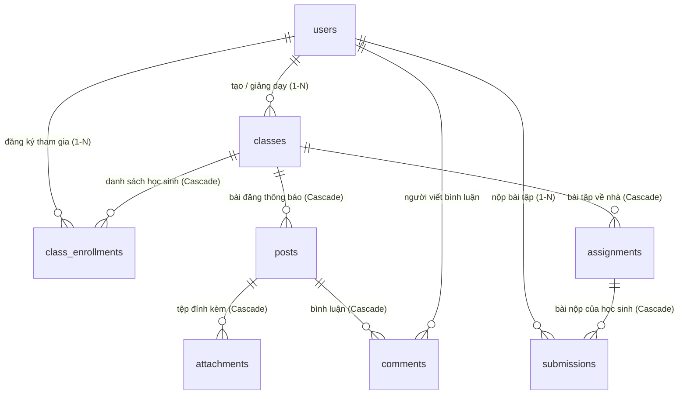

# Smart Learning Platform - Database & Architecture 🎓

Tài liệu thiết kế Cơ sở Dữ liệu (Database Schema) và Kiến trúc Backend cho dự án **Smart Learning Platform** (Hệ thống Quản lý Học tập Trực tuyến).

---

## 🛠️ Công nghệ sử dụng

- **Database**: PostgreSQL 15/16.
- **ORM & Models**: SQLAlchemy 2.0 (Python).
- **Migration Tool**: Alembic (Quản lý phiên bản Database).
- **Backend Framework**: FastAPI + Uvicorn.
- **Containerization**: Docker & Docker Compose.

---

## 🗄️ Cấu trúc Cơ sở Dữ liệu (Database Schema)

Hệ thống bao gồm **8 bảng dữ liệu (Entities)** và **4 kiểu liệt kê (Enums)** được liên kết chặt chẽ:

### 1. Danh sách các Enum Types
- `user_role`: `ADMIN`, `INSTRUCTOR`, `STUDENT`.
- `user_status`: `ACTIVE`, `INACTIVE`.
- `class_status`: `ACTIVE`, `ARCHIVED`.
- `submission_state`: `ON_TIME`, `LATE`.

### 2. Danh sách các Bảng Dữ liệu (Tables)
1. **`users`**: Quản lý người dùng (`email`, `hashed_password`, `full_name`, `role`, `status`).
2. **`classes`**: Thông tin lớp học (`title`, `subject`, `description`, `join_code`, `instructor_id`, `status`).
3. **`class_enrollments`**: Danh sách học sinh tham gia lớp học (Ràng buộc duy nhất `uq_class_student`).
4. **`posts`**: Bài đăng / Thông báo trong lớp học (`class_id`, `author_id`, `content`).
5. **`attachments`**: Tệp đính kèm bài đăng (`post_id`, `file_url`, `file_type`).
6. **`comments`**: Bình luận bài đăng (`post_id`, `user_id`, `content`).
7. **`assignments`**: Bài tập về nhà (`class_id`, `title`, `due_date`, `max_score`, `file_url`).
8. **`submissions`**: Bài nộp của học sinh (`assignment_id`, `student_id`, `file_url`, `status`, `grade`, `feedback`, ràng buộc duy nhất `uq_assignment_student`).

---

## 📊 Sơ đồ Mối quan hệ giữa các Bảng (ERD)



---

## 📁 Cấu trúc Thư mục Dự án

```text
smart-learning-platform/
├── docker-compose.yml        # Cấu hình containerization cho toàn bộ ứng dụng
├── .env.example              # File biến môi trường mẫu
├── .env                      # File biến môi trường thực tế (được gitignore)
├── README.md                 # Tài liệu thiết kế Database
└── backend/
    ├── app/
    │   ├── main.py           # Entrypoint khởi tạo ứng dụng FastAPI
    │   ├── db.py             # Cấu hình kết nối PostgreSQL Engine & Session
    │   ├── models.py         # Khai báo SQLAlchemy Models & Enums
    │   └── seed.py           # Script khởi tạo dữ liệu mẫu (Seed Data)
    ├── alembic/              # Thư mục quản lý Migrations (Alembic)
    │   ├── env.py            # Cấu hình nạp DB URL & Metadata cho Alembic
    │   └── versions/         # Chứa các file lưu vết thay đổi cấu trúc DB
    ├── Dockerfile            # Cấu hình Docker image cho Backend
    ├── entrypoint.sh         # Script tự động nâng cấp Migration & Seed Data khi start container
    └── requirements.txt      # Thư viện Python phụ thuộc
```

---

## 🚀 Hướng dẫn Khởi chạy & Kiểm tra Database

### 1. Thiết lập biến môi trường
Tạo file `.env` từ file mẫu `.env.example`:

```bash
cp .env.example .env
```

### 2. Chạy ứng dụng bằng Docker Compose
Mở Docker Desktop và chạy lệnh:

```bash
docker compose up --build
```

Docker sẽ tự động:
- Khởi chạy PostgreSQL Container (`port 5432`).
- Tự động chạy Alembic Migration tạo 8 bảng dữ liệu.
- Tự động chạy script `seed.py` nạp dữ liệu mẫu vào Database.

### 3. Kiểm tra dữ liệu trong Database
Truy cập container PostgreSQL để xem danh sách các bảng đã tạo:

```bash
docker exec -it smart_learning_db psql -U classroom -d classroom_db -c "\dt"
```

---

## 🔄 Quy trình Nâng cấp / Thay đổi Cấu trúc Database (Alembic)

Nếu bạn thay đổi hoặc bổ sung thuộc tính trong [backend/app/models.py](backend/app/models.py):

1. **Tạo bản migration mới**:
   ```bash
   cd backend
   alembic revision --autogenerate -m "Mô tả thay đổi"
   ```

2. **Cập nhật thay đổi vào Database**:
   ```bash
   alembic upgrade head
   ```