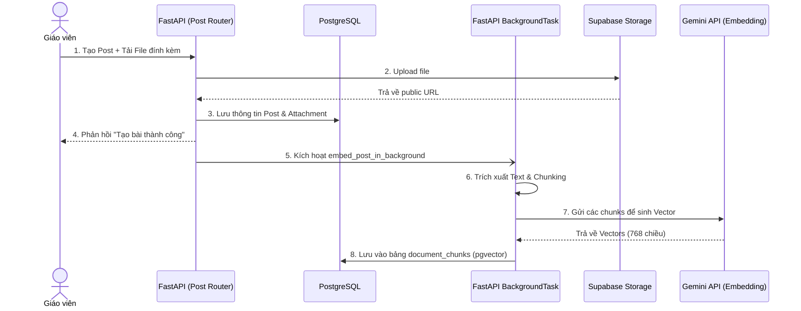
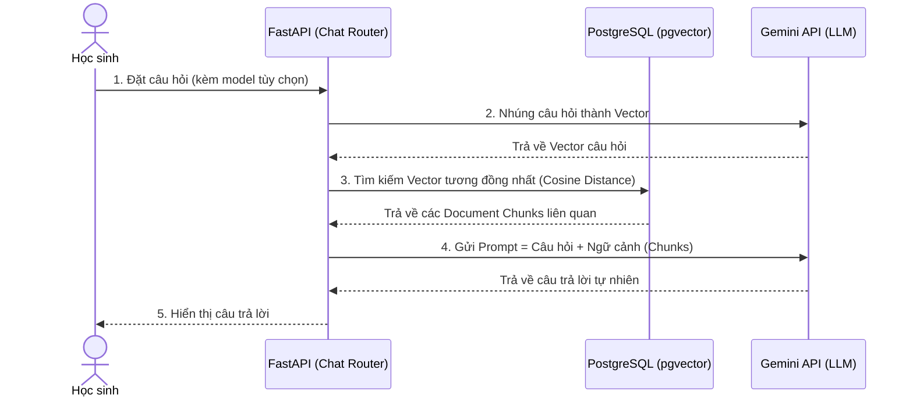

# Luồng hoạt động của Trợ lý AI (RAG System) 🤖

Module `ai_chat` là bộ não của Trợ lý ảo AI, được xây dựng theo kiến trúc **Retrieval-Augmented Generation (RAG)**. Nó hoạt động độc lập và bảo mật dữ liệu riêng biệt cho từng Lớp học (`class_id`).

## 1. Luồng Nhúng Tài liệu (Background Embedding Pipeline)

Khi Giáo viên đăng thông báo hoặc bài tập mới có kèm tài liệu (PDF, DOCX, XLSX, PPTX, v.v.), hệ thống sẽ thực hiện các bước sau một cách **âm thầm (Background Tasks)** để không làm chậm API tạo bài:

## 2. Luồng Trò chuyện AI (RAG Chat Pipeline)

Khi Học sinh đặt câu hỏi, AI sẽ tìm kiếm các tài liệu liên quan nhất trong Lớp học đó để làm ngữ cảnh trả lời:

